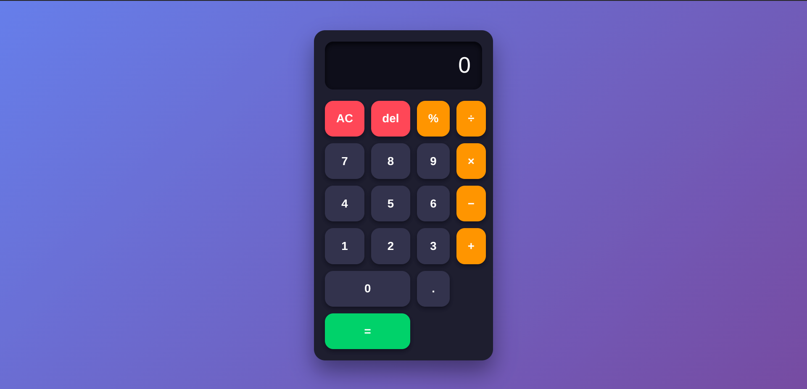

calculator using html css js

Features:

    Beautiful modern design with smooth animations
    Supports keyboard input
    Basic operations (+, −, ×, ÷, %)
    Clear (AC) and Delete (⌫) buttons
    Responsive display

Enjoy your calculator! 🚀

a good readme file in english

Here's a clean, professional, and well-structured README.md file for your calculator project:

# Calculator

A modern, responsive, and elegant calculator built with **HTML, CSS, and JavaScript**.

## ✨ Features

- ✅ Clean and modern dark UI design
- ✅ Basic arithmetic operations (`+`, `−`, `×`, `÷`, `%`)
- ✅ Responsive design (works great on mobile & desktop)
- ✅ Keyboard support (numbers, operators, Enter, Backspace, Escape)
- ✅ Delete last digit (⌫) and Clear All (AC)
- ✅ Smooth animations and hover effects
- ✅ Error handling (e.g., division by zero)

## 🖥️ Demo

You can try the live demo by opening `index.html` in any modern web browser.

## 📁 Project Structure

## ✨ Features

- ✅ Clean and modern dark UI design
- ✅ Basic arithmetic operations (`+`, `−`, `×`, `÷`, `%`)
- ✅ Responsive design (works great on mobile & desktop)
- ✅ Keyboard support (numbers, operators, Enter, Backspace, Escape)
- ✅ Delete last digit (⌫) and Clear All (AC)
- ✅ Smooth animations and hover effects
- ✅ Error handling (e.g., division by zero)

## 🖥️ Demo

You can try the live demo by opening `index.html` in any modern web browser.
